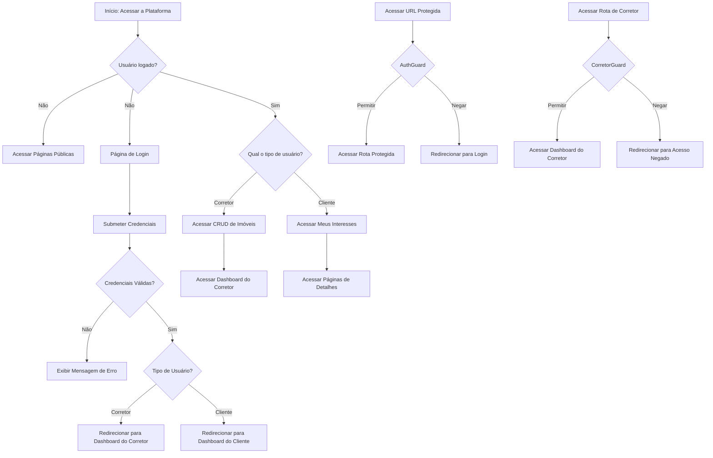
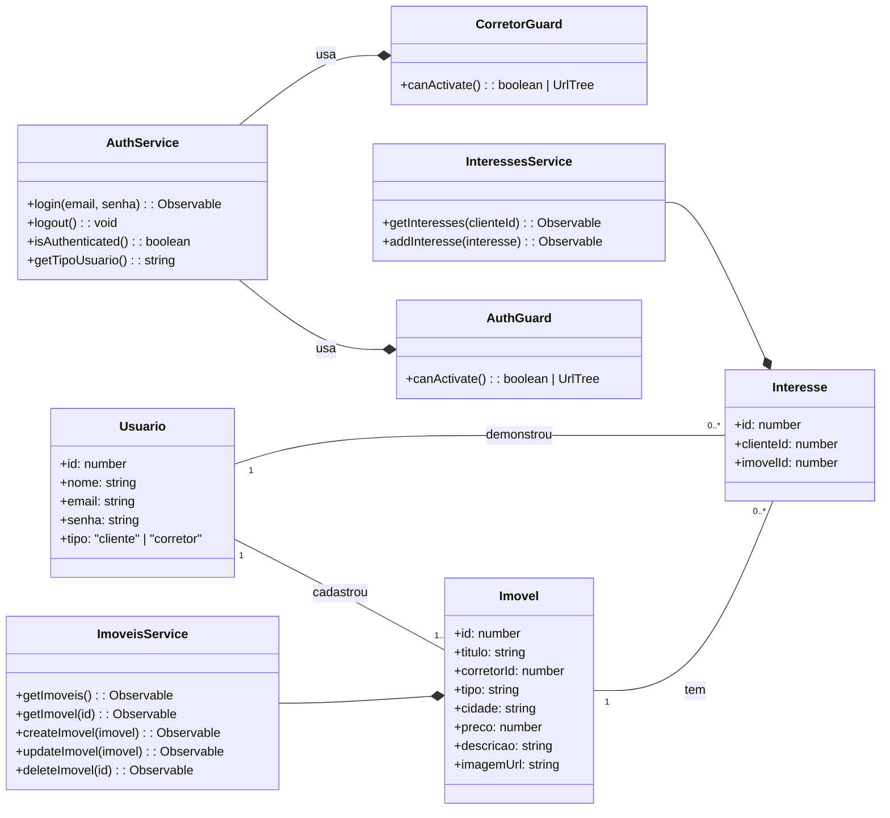
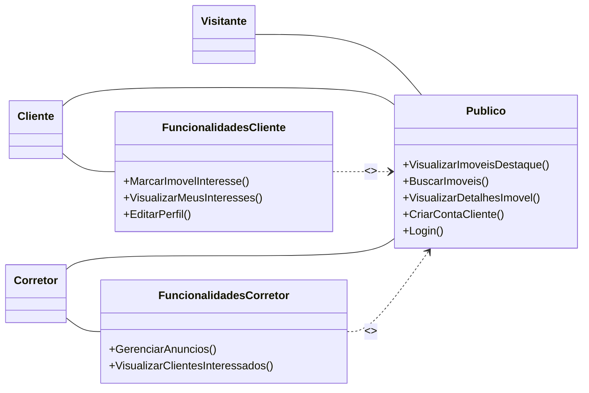

# 🏡 Imobiliária Prime - Plataforma Web

## 📝 Visão Geral do Projeto

A **Imobiliária Prime** é uma **Single Page Application (SPA)** desenvolvida em **Angular** com o objetivo de conectar **corretores de imóveis** e **clientes** de forma moderna e segura.

O sistema implementa **autenticação e autorização robustas**, permitindo que corretores gerenciem seus próprios anúncios e clientes registrem seus interesses.

### 🎯 Objetivo Geral

Criar um **protótipo funcional, responsivo e seguro** que demonstre o ciclo de vida dos imóveis na plataforma, com **acesso diferenciado por perfil** (cliente e corretor).

---

## 🛠️ Tecnologias Utilizadas

* **Frontend Framework**: Angular (preferencialmente com *Standalone Components*)
* **Linguagem**: TypeScript
* **Estilização**: SCSS (design responsivo)
* **Comunicação API**: HttpClient (com Observables da RxJS)
* **Simulação de Backend**: JSON Server
* **Gerenciamento de Estado (Sessão)**: LocalStorage / SessionStorage
* **Formulários**: Reactive Forms

---

## 🚦 Estrutura de Rotas e Segurança

O projeto utiliza **Guardas de Rota (Route Guards)** implementadas como `CanActivateFn` para proteger o acesso com base no perfil do usuário.

| Rota                  | Descrição                                  | Segurança Requerida              |
| --------------------- | ------------------------------------------ | -------------------------------- |
| `/home`               | Página inicial e destaques.                | Pública (sem Auth)               |
| `/catalogo`           | Lista completa de imóveis.                 | Pública (sem Auth)               |
| `/detalhe/:id`        | Detalhes de um imóvel.                     | Pública (sem Auth)               |
| `/login`              | Formulário de autenticação unificado.      | Pública (sem Auth)               |
| `/registro`           | Cadastro de novos clientes.                | Pública (sem Auth)               |
| `/cliente/interesses` | Lista de imóveis com interesse do cliente. | AuthGuard (logado)               |
| `/corretor/dashboard` | CRUD e gerenciamento de imóveis.           | CorretorGuard (perfil: corretor) |

### 🔒 Guardas de Rota

* **AuthGuard**: Verifica se há um usuário autenticado (logado).
* **CorretorGuard**: Verifica se o usuário logado possui o tipo `"corretor"`.

---

## ⚙️ Requisitos Funcionais por Perfil

### 📌 Acesso Público / Visitante

* Visualizar a página inicial `/home` com imóveis em destaque.
* Navegar pelo catálogo completo de imóveis.
* Ver detalhes de qualquer imóvel.
* Acessar as telas de **Login** e **Registro de Cliente**.

### 👤 Perfil: Cliente (`tipo: "cliente"`)

* **RF-C01**: Marcar e desmarcar interesse em um imóvel.
* **RF-C02**: Visualizar a lista exclusiva de "Meus Interesses".
* **RF-C03**: Editar seus dados de perfil.

### 👨‍💼 Perfil: Corretor (`tipo: "corretor"`)

* **RF-CO01**: Acessar o Dashboard do Corretor (`/corretor/dashboard`).
* **RF-CO02**: CRUD (Criar, Ler, Atualizar, Excluir) de seus próprios anúncios (filtrados por `corretorId`).
* **RF-CO03**: Visualizar a lista de clientes que manifestaram interesse em seus imóveis.

---

## 📂 Estrutura de Dados (JSON Server)

### Coleções

* **usuarios** → autenticação e perfis (cliente, corretor).
* **imoveis** → dados de anúncios de imóveis.
* **interesses** → relaciona clientes a imóveis desejados.

### Chaves de Relacionamento

* `usuarios.id` (cliente ou corretor)
* `imoveis.corretorId`
* `interesses.clienteId` + `interesses.imovelId`

### Exemplo `db.json`

```json
{
  "usuarios": [
    { "id": 1, "nome": "Carlos Corretor", "email": "corretor@prime.com", "senha": "123", "tipo": "corretor" },
    { "id": 2, "nome": "Ana Cliente", "email": "cliente@email.com", "senha": "123", "tipo": "cliente" }
  ],
  "imoveis": [],
  "interesses": []
}
```

---

## 🎨 Identidade Visual

A identidade visual segue uma paleta de cores modernas e confiáveis:

* **Primária (Destaque):** `#009B77` (Verde Esmeralda)
* **Secundária (Fundo/Navbar):** `#333333` (Cinza Escuro)
* **Fundo Principal:** `#FFFFFF` (Branco)

---

## 🚀 Próximos Passos

* [ ] Finalizar **protótipo UI/UX** (Login, Home, Dashboard Corretor).
* [ ] Configurar projeto Angular e JSON Server.
* [ ] Criar **AuthService** e **ImoveisService**.

*Diagrama de Fluxo*


*Diagrama de Classes*


*Diagrama de Casos de Uso*


* [ ] Implementar **AuthGuard** e **CorretorGuard**.
* [ ] Implementar **CRUD completo** no Dashboard do Corretor.
